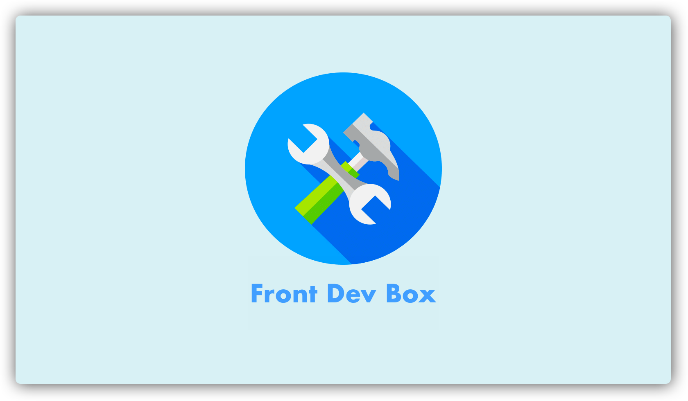

# Front Dev Box

> Toolbox for front-end development

## Preview

Live preview: [https://front-dev-box.netlify.com](https://front-dev-box.netlify.com)

Source code: [https://github.com/chuntonggao/front-dev-box](https://github.com/chuntonggao/front-dev-box)

## Features

- [x] Third-party search engines, not supporting Google, GitHub, NPM, Stack Overflow, MDN and Medium
- [x] Categorized sections, user-friendly interface
- [x] Continuous integration & automated deployment on Netlify

## Technologies

- Vue: MVVM front-end framework
- Element: UI library for Vue
- Webpack: supports vue-loader, url-loader, html-webpack-plugin, hot loading, etc.
- Automated code quality control: eslint, stylelint, husky, lint-staged
- Testing: united tested with karma, mocha, chai, @vue/test-utils

## How to contribute

If you want to add more links to this toolbox:

1. Fork the repo

2. Modify `src/db/db.js`

3. Submit a pull request
